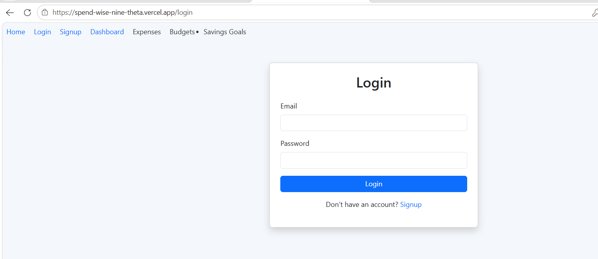
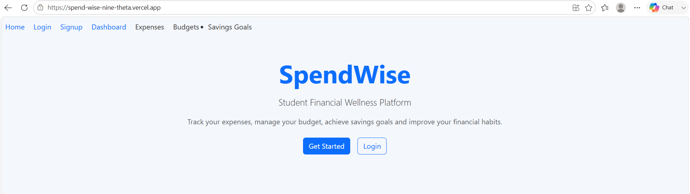
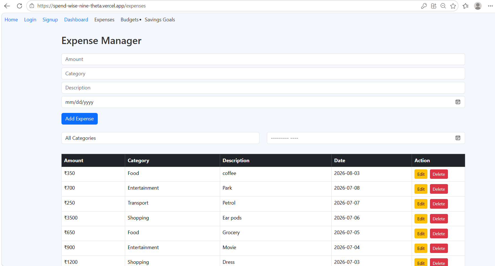
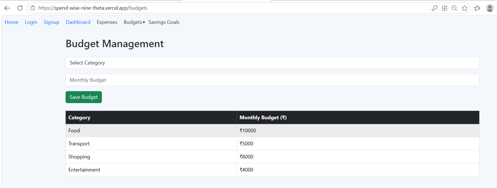
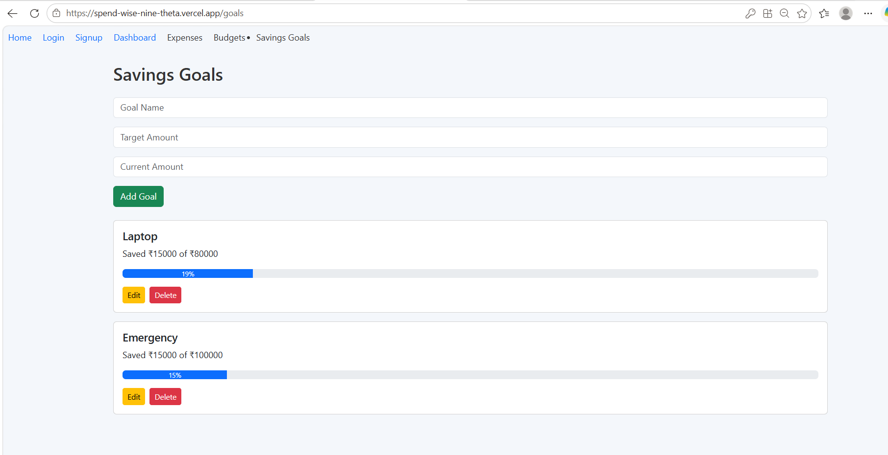

# 💰 SpendWise – Personal Finance Management Web Application

## 📖 Overview

SpendWise is a full-stack personal finance management web application that helps users manage their daily finances by tracking expenses, setting budgets, monitoring savings goals, and analyzing spending patterns through interactive dashboards.

The project also includes SQL-based data analysis using SQLite and business intelligence reporting using Power BI.

---

## 🚀 Live Demo

**Frontend:**  
https://spend-wise-nine-theta.vercel.app

**Backend:**  
https://spendwise-backend-ishwarya.onrender.com

---

## ✨ Features

- Secure User Authentication (JWT)
- Expense Management (Add, Edit, Delete)
- Monthly Budget Management
- Savings Goal Tracking
- Expense Filtering by Category and Month
- Interactive Analytics Dashboard
- SQL Analysis using SQLite
- Power BI Dashboard for Business Insights

---

## 🛠 Tech Stack

### Frontend
- React.js
- Bootstrap
- Axios
- React Router
- Recharts

### Backend
- Node.js
- Express.js
- JWT Authentication

### Database
- MongoDB Atlas

### Data Analysis
- SQLite
- Power BI

### Deployment
- Vercel
- Render

---

## 📷 Screenshots
### Login

### Landing Page

### Dashboard

### Expenses

### Budgets

### Savings Goals

### Power BI Dashboard


---

## ⚙️ Installation

### Clone the Repository

```bash
git clone https://github.com/Ishwarya23-K/SpendWise.git
```

### Backend

```bash
cd backend
npm install
npm start
```

### Frontend

```bash
cd frontend
npm install
npm start
```

---

## 💡 Future Enhancements

- AI-based Expense Prediction
- OCR Receipt Scanner
- PDF Report Export
- Email Notifications
- Dark Mode
- Mobile Application

---

## 👩‍💻 Developed By

Ishwarya K
Jesly Rowena J A

B.Tech Information Technology

SASTRA Deemed University